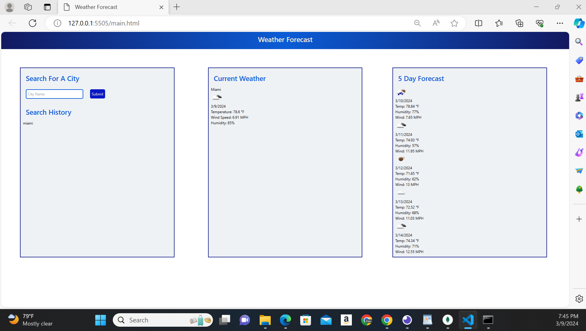

# My-Weather-Forecaster

## Overview
The My Weather Forecaster is for anyone especially travlers who want to stay up to date with the current and forecasted weather. This app allows the user to not only view weather both current and 5-day forecast, but also provides easy recall to previsouly searched cities, allowing the user to plan accordingly.

## Features
*Seacrh by city: This allow the user to search for thier desired city to view is current and forecasted weather.

*Search History: This feature allows the user to easily go back to previsouly seached cities by selectin the city in the search history. The weather for the selected saved city will load onto the page.

*Current Weather: A display of the city name, date, weather icon, humidity, temperature, and wind speed.

*5-Day Forecast: This app allow the user to view the forecated weather for the city they have chosen. Displaying date, weather icon, humidity, temperature, and wind speed.

## Technologies Used
*OpenWeatherMap API (https://api.openweathermap.org)
*HTML
*CSS
*JavaScript

## Credits
OpenWeatherMap API was use to provide the weather data for this app. 

## How to Use
*Enter the name of the city you wish to view weather for in the search bar.
*The current weather and 5-day forecast will appear for your viewing pleasure.
*To view a previsouly searched city's weather, just click on the city name in the history section.

Created by: Blair Dowling

